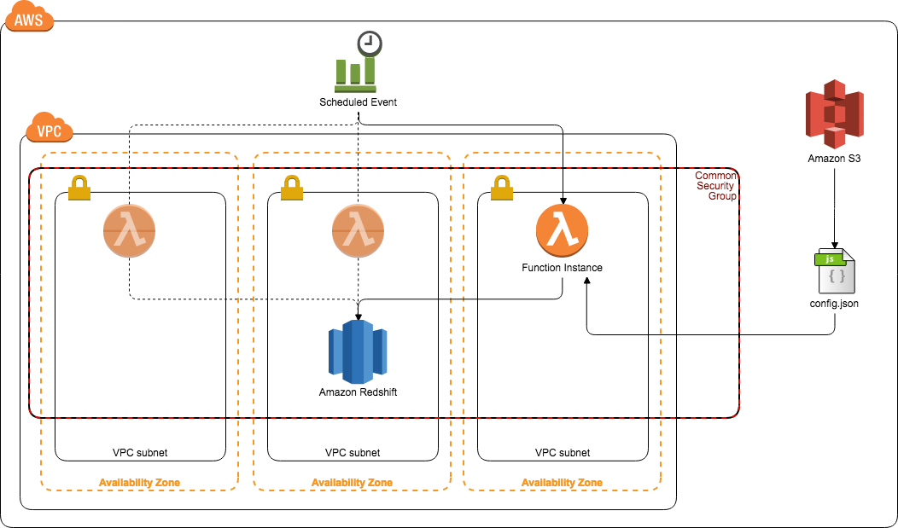
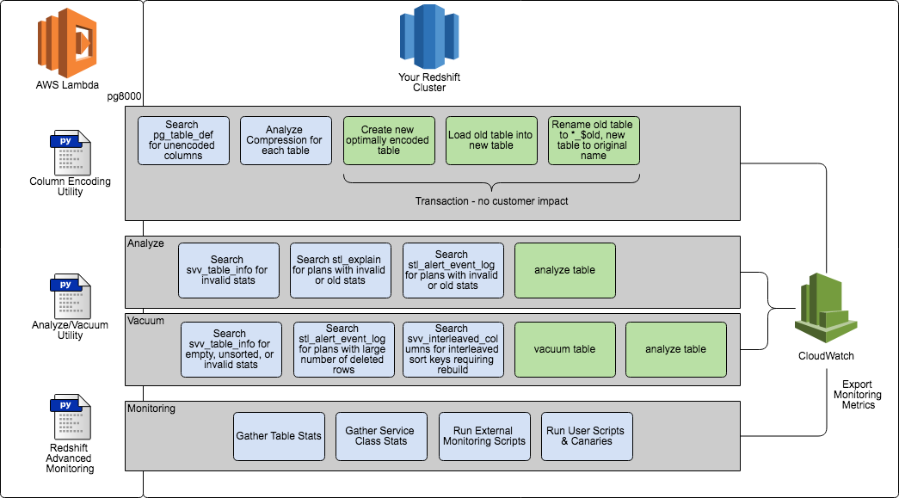

# AWS Lambda Utility Runner

This project includes code that is able to run a subset of the Amazon Redshift Utilities via AWS Lambda. By using a Lambda function scheduled via a [CloudWatch Event](http://docs.aws.amazon.com/AmazonCloudWatch/latest/DeveloperGuide/WhatIsCloudWatchEvents.html), you can ensure that these valuable utilities run automatically and keep your Redshift cluster running well.



This utility creates a Lambda function which imports other Redshift Utils modules, and then invokes them against a cluster. It runs within your VPC, and should be configured to connect via a Subnet which is either the same, or can route to the subnet where your Redshift cluster is running. It should also be configured with a Security Group which is trusted by your [Redshift Cluster Security Configuration](http://docs.aws.amazon.com/redshift/latest/mgmt/working-with-security-groups.html).

Currently the [Column Encoding Utility](src/ColumnEncodingUtility) and [Analyze/Vacuum Utility](src/AnalyzeVacuumUtility) are supported for automated invocation:



## Setup Pre-Tasks

Because these utilities need to access your Redshift cluster, they require a username and password for authentication. This function reads these values from a configuration file, and expects that the database password is a base64 encoded string that has been encrypted by [AWS KMS](https://aws.amazon.com/kms). In order to authenticate when the utility is run by AWS Lambda, the IAM role granted to AWS Lambda must have rights to decrypt data using KMS, and must also include this application's internal encryption context (which you may change if you desire).

To encrypt your password for use by this function, please run the [encrypt_password.py](encrypt_password.py) script, and type your password as the first argument:

```
> export AWS_REGION=my-aws-region
> (python) encrypt_password.py MY_SECRET_PASSWORD
```

This will create the required Customer Master Key in KMS, along with a key alias that makes it easy to work with (called ```alias/RedshiftUtilsLambdaRunner```) and so must be run as a user with rights to do so. It will then encrypt the supplied password and output the encrypted ciphertext as a base64 encoded string:

```
$ ./encrypt_password.py MY_SECRET_PASSWORD
Encryption Complete
Encrypted Password: CiChAYm4goRPj1CuMlY+VbyChti8kHVW4kxInA+keC7gPxKZAQEBAgB4oQGJuIKET49QrjJWPlW8gobYvJB1VuJMSJwPpHgu4D8AAABwMG4GCSqGSIb3DQEHBqBhMF8CAQAwWgYJKoZIhvcNAQcBMB4GCWCGSAFlAwQBLjARBAwdVzuq29SCuPKlh9ACARCALY1H/Tb4Hw73yqLyL+Unjp4NC0F5UjETNUGPtM+DTHG8urILNTKvdv1t9S5zuQ==
```

Copy the value after ```Encrypted Password: ``` an use it for the creation of the config file

## Configuration

This lambda function uses a configuration file to get information about which cluster to connect to, which utilities to run, and other information it needs to accomplish its task. An example `config-example.json` is included to get you started. You configure which utility to run in the ```'utilities'``` array - currently the values ```ColumnEncodingUtility, AnalyzeVacuumUtility``` are supported

The required configuration items are placed into the ```configuration``` part of the config file, and include:

```
{"utilities":[("ColumnEncodingUtility"|"AnalyzeVacuumUtility")], - list of utilities to run. Can provide multiple values
"configuration": {
  "analyzeTable": "The name of a specific table to analyze",
  "analyzeSchema": "The name of the schema to be analyzed. Either analyzeSchema or analyzeTable must be provided",
  "comprows": Int - set to -1 for default. This is the number of rows that will be considered per slice for Column Encoding,
  "db": "master",
  "dbHost": "Hostname of the Redshift Cluster master node to connect to",
  "dbPassword": "base64 encoded password obtained by running encrypt_password.py",
  "dbPort": Int - the database port,
  "dbUser": "The Database Username to connect to",
  "dropOldData": Boolean - should the current version of the table be dropped after operations complete?,
  "ignoreErrors": Boolean - should the system keep running even if errors are encountered?,
  "queryGroup": "The database query group setting to use for WLM",
  "querySlotCount": Int - the number of WLM slots to request for the given queryGroup,
  "targetSchema": "The schema name where newly encoded tables should be placed. Leave as "" for using the analyzeSchema",
  "force": Boolean - do you want to force the utility to run even if there are no likely changes?,
  "outputFile":"The path of the file to create on the filesystem. AWS Lambda can only write to /tmp",
  "debug":Boolean - turn on debug logging of actions and SQL run on the cluster,
  "analyze_col_width": 1 - analyze colums of this size or larger during AnalyzeVaccum,
  "ssl-option":"" - whether ssl is required to connect to the cluster,
  "doVacuum": "(true|false) Should the Analyze Vacuum utility run Vacuum?",
  "doAnalyze":"(true|false) Should the Analyze Vacuum utility run Analyze?",
  "tableBlacklist":"comma separated list of tables to suppress running the analyze vacuum utility against"  
  }
}
```

Save this configuration to a json file, and place it on S3. We will refer to the file when we launch the SAM Template. Alternatively you can rebuild the project manually using filename 'config.json', and it will automatically be imported.

## Deploying

We have provided the following AWS SAM templates so that you can deploy this function automatically (please note that we currently only support deploying into VPC):

| Region | Template |
| ------ | ---------- |
|ap-northeast-1 |  [](https://console.aws.amazon.com/cloudformation/home?region=ap-northeast-1#/stacks/new?stackName=RedshiftAutomation&templateURL=https://s3-ap-northeast-1.amazonaws.com/awslabs-code-ap-northeast-1/LambdaRedshiftRunner/deploy.yaml) |
|ap-northeast-2 |  [](https://console.aws.amazon.com/cloudformation/home?region=ap-northeast-2#/stacks/new?stackName=RedshiftAutomation&templateURL=https://s3-ap-northeast-2.amazonaws.com/awslabs-code-ap-northeast-2/LambdaRedshiftRunner/deploy.yaml) |
|ap-south-1 |  [](https://console.aws.amazon.com/cloudformation/home?region=ap-south-1#/stacks/new?stackName=RedshiftAutomation&templateURL=https://s3-ap-south-1.amazonaws.com/awslabs-code-ap-south-1/LambdaRedshiftRunner/deploy.yaml) |
|ap-southeast-1 |  [](https://console.aws.amazon.com/cloudformation/home?region=ap-southeast-1#/stacks/new?stackName=RedshiftAutomation&templateURL=https://s3-ap-southeast-1.amazonaws.com/awslabs-code-ap-southeast-1/LambdaRedshiftRunner/deploy.yaml) |
|ap-southeast-2 |  [](https://console.aws.amazon.com/cloudformation/home?region=ap-southeast-2#/stacks/new?stackName=RedshiftAutomation&templateURL=https://s3-ap-southeast-2.amazonaws.com/awslabs-code-ap-southeast-2/LambdaRedshiftRunner/deploy.yaml) |
|ca-central-1 |  [](https://console.aws.amazon.com/cloudformation/home?region=ca-central-1#/stacks/new?stackName=RedshiftAutomation&templateURL=https://s3-ca-central-1.amazonaws.com/awslabs-code-ca-central-1/LambdaRedshiftRunner/deploy.yaml) |
|eu-central-1 |  [](https://console.aws.amazon.com/cloudformation/home?region=eu-central-1#/stacks/new?stackName=RedshiftAutomation&templateURL=https://s3-eu-central-1.amazonaws.com/awslabs-code-eu-central-1/LambdaRedshiftRunner/deploy.yaml) |
|eu-west-1 |  [](https://console.aws.amazon.com/cloudformation/home?region=eu-west-1#/stacks/new?stackName=RedshiftAutomation&templateURL=https://s3-eu-west-1.amazonaws.com/awslabs-code-eu-west-1/LambdaRedshiftRunner/deploy.yaml) |
|eu-west-2 |  [](https://console.aws.amazon.com/cloudformation/home?region=eu-west-2#/stacks/new?stackName=RedshiftAutomation&templateURL=https://s3-eu-west-2.amazonaws.com/awslabs-code-eu-west-2/LambdaRedshiftRunner/deploy.yaml) |
|sa-east-1 |  [](https://console.aws.amazon.com/cloudformation/home?region=sa-east-1#/stacks/new?stackName=RedshiftAutomation&templateURL=https://s3-sa-east-1.amazonaws.com/awslabs-code-sa-east-1/LambdaRedshiftRunner/deploy.yaml) |
|us-east-1 |  [](https://console.aws.amazon.com/cloudformation/home?region=us-east-1#/stacks/new?stackName=RedshiftAutomation&templateURL=https://s3-us-east-1.amazonaws.com/awslabs-code-us-east-1/LambdaRedshiftRunner/deploy.yaml) |
|us-east-2 |  [](https://console.aws.amazon.com/cloudformation/home?region=us-east-2#/stacks/new?stackName=RedshiftAutomation&templateURL=https://s3-us-east-2.amazonaws.com/awslabs-code-us-east-2/LambdaRedshiftRunner/deploy.yaml) |
|us-west-1 |  [](https://console.aws.amazon.com/cloudformation/home?region=us-west-1#/stacks/new?stackName=RedshiftAutomation&templateURL=https://s3-us-west-1.amazonaws.com/awslabs-code-us-west-1/LambdaRedshiftRunner/deploy.yaml) |
|us-west-2 |  [](https://console.aws.amazon.com/cloudformation/home?region=us-west-2#/stacks/new?stackName=RedshiftAutomation&templateURL=https://s3-us-west-2.amazonaws.com/awslabs-code-us-west-2/LambdaRedshiftRunner/deploy.yaml) |

Alternatively, you can manually upload the template from the `dist` directory. For both the package md5 is `dd3483885a03dc3ea2a07bab3eacf353`. There are also separate templates to [just deploy a single utility](deploy-function-and-schedule.yaml) or just [create a scheduled event for an existing function](deploy-schedule.yaml). You must supply the following parameters


When completed, it will deploy the following objects:


* `LambdaRedshiftAutomationRole`: IAM Role giving Lambda the rights to download the configuration from S3, and to decrypt the password using KMS
* `RedshiftAutomation-LambdaRedshiftAutomation-**********`: The AWS Lambda Function which runs via the CloudWatch Scheduled Events
* `InvokeLambdaRedshiftRunner-AnalyzeVacuumUtility`: The CloudWatch Scheduled Event which runs the [Analyze & Vacuum Utility](https://github.com/awslabs/amazon-redshift-utils/tree/master/src/AnalyzeVacuumUtility)
* `InvokeLambdaRedshiftRunner-ColumnEncodingUtility`: The CloudWatch Scheduled Event which runs the [Column Encoding Utility](https://github.com/awslabs/amazon-redshift-utils/tree/master/src/ColumnEncodingUtility)
* _2 AWS Lambda Permissions are also created so that CloudWatch Events can call the Lambda function_

## Running the Modules

These utilites are configured to run via CloudWatch Scheduled Events. You will see that each of the scheduled events includes a payload of input which enables the function to download the configuration and run the correct utility per-instance:

__To run the Column Encoding Utility__

```javascript
{"ExecuteUtility":"ColumnEncodingUtility","ConfigLocation":"s3//mybucket/myprefix/config.json"}
```

__To run the Analyze/Vacuum Utility__

```javascript
{"ExecuteUtility":"AnalyzeVacuumUtility","ConfigLocation":"s3//mybucket/myprefix/config.json"}
```

You can change the CRON schedule for each event so they don't run at the same time, if you prefer.

## Rebuilding the Project 

If you do need to rebuild, this module imports the required utilities from other parts of this GitHub project as required. It also imports its required dependencies and your ```config.json``` and builds a zipfile that is suitable for use by AWS Lambda. To build this module after customising your config file or the code, just run ```build.sh```. This will result in zipfile ```lambda-redshift-util-runner-$version.zip``` being created in the root of the ```LambdaRunner``` project. You can then deploy this zip file to AWS Lambda , but be sure to set your runtime language to 'python(2.7|3.5)', and the timeout to a value long enough to accomodate running against all your tables.

Also, when you include a config.json, this function connects to only one Redshift cluster. If you do this, we encourate you to use a Lambda function name that will be easy to understand which instance you have pointed to. For instance, you might name it ```RedshiftUtilitiesMyClusterMyUser```.

----

Amazon Redshift Utils - Lambda Runner

Copyright 2017-2017 Amazon.com, Inc. or its affiliates. All Rights Reserved.

Amazon Software License: https://aws.amazon.com/asl